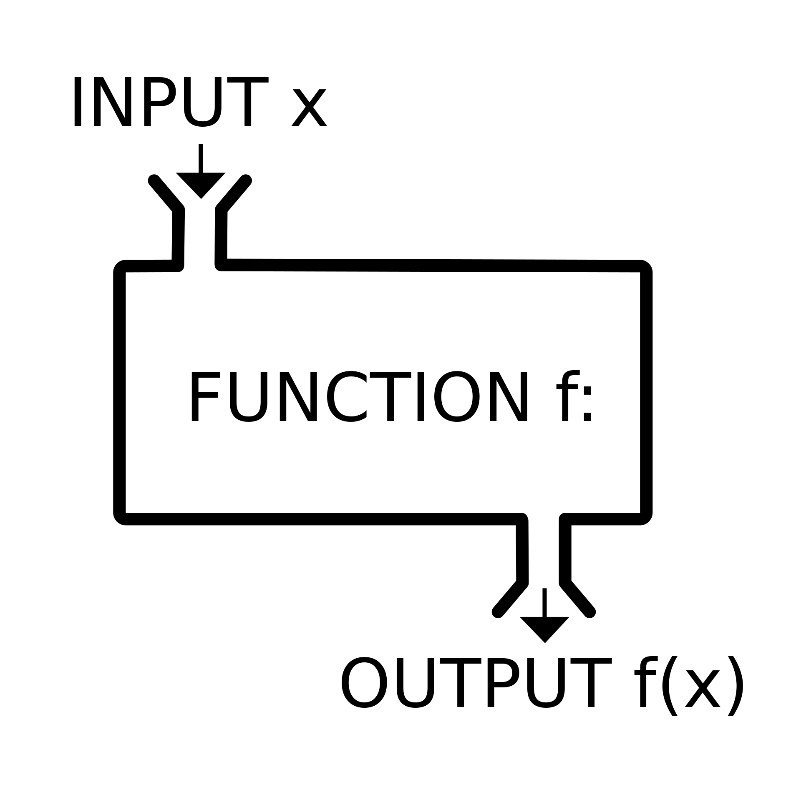
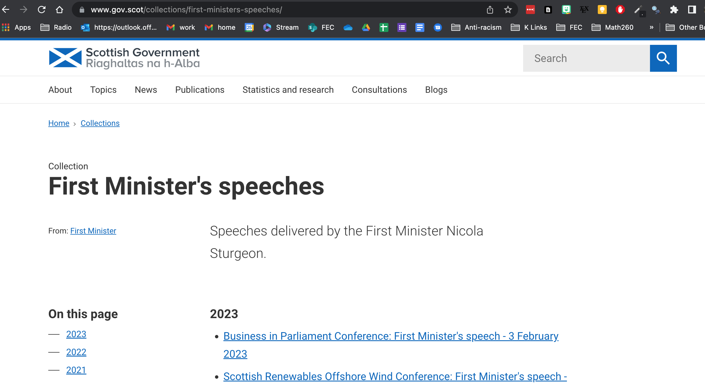
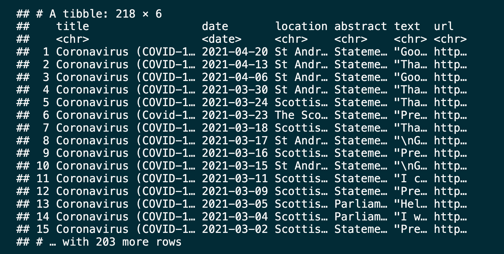
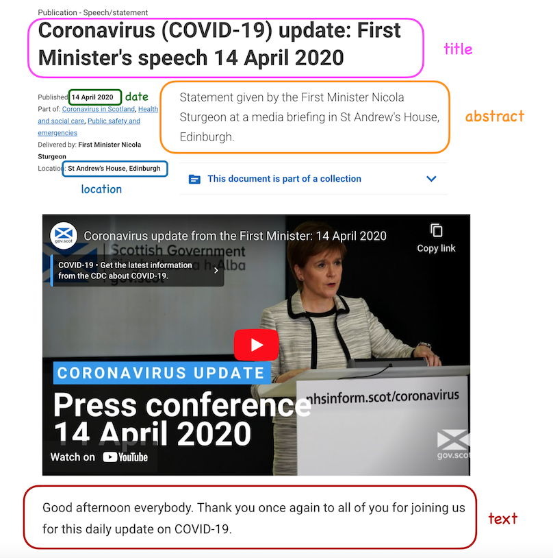
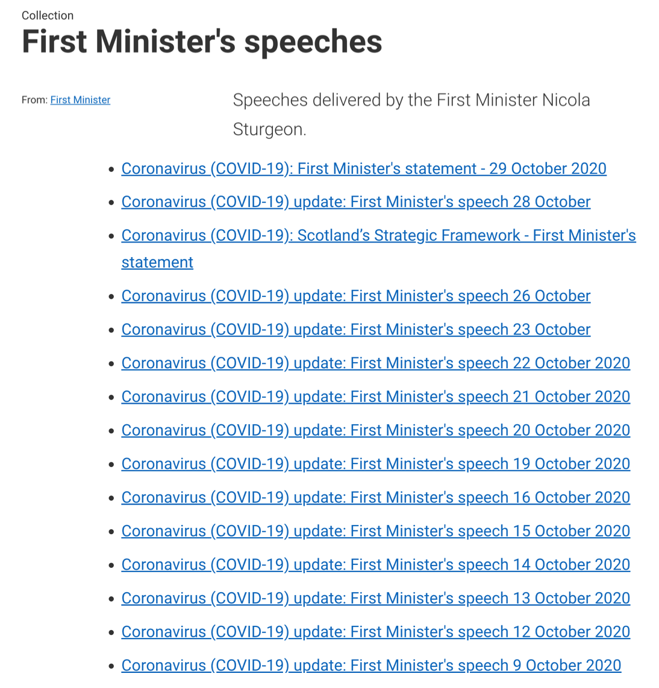

```{r setup, include=FALSE}
knitr::opts_chunk$set(echo = TRUE,message=FALSE,warning=FALSE, cache = FALSE)
library(knitr)
hook_output <- knit_hooks$get("output")
knit_hooks$set(output = function(x, options) {
  lines <- options$output.lines
  if (is.null(lines)) {
    return(hook_output(x, options))  # pass to default hook
  }
  x <- unlist(strsplit(x, "\n"))
  more <- "..."
  if (length(lines)==1) {        # first n lines
    if (length(x) > lines) {
      # truncate the output, but add ....
      x <- c(head(x, lines), more)
    }
  } else {
    x <- c(more, x[lines], more)
  }
  # paste these lines together
  x <- paste(c(x, ""), collapse = "\n")
  hook_output(x, options)
})
```

```{r packages, echo=FALSE, message=FALSE, warning=FALSE}
library(tidyverse)
library(rvest)
#library(backports)
```


# Agenda

* Introduction to Functions  

* Investigation: Applications to scraping


---
class: inverse, center, middle

# Functions  

---
## From Calculus  

* A function is a rule  

* For every input we can only get one output  

* Passes vertical line test  

```{r, echo = F, fig.height = 4, warning = FALSE}
x <- seq(-2, 6, .05)
y <- x^3 - 6*x^2 + 4*x + 12
plot(x, y, 
     type="l", 
     xaxt='n', yaxt='n', 
     bty='n', 
     xlab='', ylab='', 
     col="blue")
##  Next add in your axis arrows:
arrows(min(x), 0, max(x), 0, lwd=1, length=0.15)
arrows(0, min(y), 0, max(y), lwd=1, length=0.15)
##  And plot your x/y labels.  Note that if you want them
##    actually at the end of the arrows you would need to 
##    remove the pos= argument and shorten your arrows by
##    a small amount.  To match your original figure, you can
##    alter the x/y coordinate to be the max() instead.
text(0, max(y), "f(x)", pos=2)
text(max(x), 0, "x", pos=3)
#axis(1)
#axis(2)
```

---

## Functions in Computer Science

```{r, out.width = '30%', fig.align='center', fig.cap='',echo=FALSE}

```


---
## Why Functions?  

```{r}
#  x^2 - 5x - 14 = 0 
(-(-5) +c(-1,1)*sqrt((-5)^2 - 4*1*(-14)))/( 2*1) 
```

```{r}
# 2x^2 + 2x − 12 = 0
(-(2) +c(-1,1)*sqrt((2)^2 - 4*(2)*(-12)))/( 2*2) 
```

```{r}
#  x^2 - 4x + 4 = 0 
(-(-4) +c(-1,1)*sqrt((-4)^2 - 4*1*(4)))/( 2*1) 
```


---

## Write a Famous Function

```{r}
quad_roots <- function(aval, bval, cval){
  (-bval +c(-1,1)*sqrt(bval^2 - 4*aval*cval))/( 2*aval) 
}
quad_roots(1, -5, -14)  
quad_roots(2, 2, -12)  
quad_roots(1, -4, 4)  # Gives repeated roots
```

---

## What goes in/What comes out?

* Functions take input(s) defined in the function definition

```{r, eval = FALSE}
function([inputs separated by commas]){
  # what to do with those inputs
}
```

* By default they return the last value computed in the function

* You can also define more outputs to be returned in a list as well as nice print methods

---
## Anonymous Functions

**Anonymous functions** are:
* Small, temporary functions
* Don't have an explicit name
* Created on the spot to perform a specific task such as transforming data
* Often used within a string of piped functions
* Typically used just once for a "customized" pupose.

Example: 
```{r, eval = FALSE}
df_miss |> 
  summarize(
    across(a:d, \(x) median(x, na.rm = TRUE)),
    n = n()
  )
```

* Read Chapter 26 to learn about iteration with `across()`.


---
class: inverse, center, middle

# Functions and Automation: Scotland First Minister's COVID speeches

---


## Goal

Use to scrape all the first minister's speeches that contain COVID in the title and create a dataset of speeches containing the following information about the speeches:

1. Title

2. Date

3. Location

4. Abstract

5. Text of the speech

6. URL address of the speech

---

## Website Table of Contents 



---

## The Goal



---

## Getting Oriented

#### [https://www.gov.scot/collections/first-ministers-speeches/](https://www.gov.scot/collections/first-ministers-speeches/)


---




---
## Plan

1. Scrape `title`, `date`, `location`, `abstract`, and `text` from a few COVID-19 speech pages to develop the code

2. Write a function that scrapes `title`, `date`, `location`, `abstract`, and `text` from COVID-19 speech pages

3. Scrape the `url`s of COVID-19 speeches from the main page

4. Use this function to scrape from each individual COVID-19 speech from these `url`s and create a data frame with the columns `title`, `date`, `location`, `abstract`, `text`, and `url`

---
class:  middle

## 1. Scrape data from a few COVID-19 speech pages

---
background-image: url("figs/fm_speeches_picture_oct20.png")
background-size: 25%
background-position: 90% 90%

## Read page for  October 26, 2020 speech

```{r, read-page}
# url <- "https://www.gov.scot/publications/coronavirus-covid-19-update-first-ministers-speech-26-october/"
speech_page <- read_html("https://www.gov.scot/publications/coronavirus-covid-19-update-first-ministers-speech-26-october/")
url <- "https://www.gov.scot/publications/coronavirus-covid-19-update-first-ministers-speech-26-october/"
```

```{r, eval= FALSE}
speech_page
```

---

## Extract title

Use Selector Gadget to find the appropriate node

```{r read-title}
title <- speech_page |>
    html_elements(".ds_page-header__title") |>
    html_text()
title
```

---


## Extract date

* Use `dmy()` to format

```{r read-date}
library(lubridate)
date <- speech_page |>
    html_elements("#sg-meta__publication-date") |>
    html_text() |>
  dmy()
date
```


---

## Extract location


```{r}
location <- speech_page |>
    html_elements(".ds_metadata__item:nth-child(5) strong") |>
    html_text() 
location
```


---

## Extract abstract


```{r}
abstract <- speech_page |>
    html_elements(".ds_no-margin--bottom") |>
    html_text() 
abstract
```


---

## Extract text


```{r}
text <- speech_page |>
    html_elements("#preamble p") |>
    html_text() |>
  list()
text
```


---

## Put it all in a data frame

```{r}
oct_26_speech <- tibble(
  title    = title,
  date     = date,
  location = location,
  abstract = abstract,
  text     = text,
  url      = url
)
oct_26_speech
```

---

## Read page for October 23, 2020 speech

```{r}
url <- "https://www.gov.scot/publications/coronavirus-covid-19-update-first-ministers-speech-23-october/"
speech_page <- read_html(url)
```

```{r}
speech_page
```

---

## Extract components of the October 23, 2020 speech

```{r}
title <- speech_page |>
  html_elements(".ds_page-header__title") |>
  html_text()
date <- speech_page |>
  html_elements("#sg-meta__publication-date") |>
  html_text() |>
  dmy()
location <- speech_page |>
  html_elements(".ds_metadata__item:nth-child(5) strong") |>
  html_text()
abstract <- speech_page |>
  html_elements(".ds_no-margin--bottom") |>
  html_text()
text <- speech_page |>
  html_elements("#preamble p") |>
  html_text() |>
  list()
```

---

## Put it all in a data frame

```{r}
oct_23_speech <- tibble(
  title    = title,
  date     = date,
  location = location,
  abstract = abstract,
  text     = text,
  url      = url
)
oct_23_speech
```


---
class: inverse, center, middle

# Isn't there a way to speed this up?

---
class:  center, middle

# Functions to the Rescue

---

## When should you write a function?

* When you’ve copied and pasted a block of code more than twice.

---

### How many times would we need to copy and paste the code we developed to scrape data on all of First Minister's COVID-19 speeches?



---

## Why functions?
  
Automate common tasks in a more powerful and general way than copy-and-pasting:  
  
* Use names that indicate what the purpose of the function
   + Avoid reserved R names: like `c`, `sum`

* Make updating code easier allowing you to update in just one place instead of many

* Eliminate mistakes with copying and pasting
   + Forgetting to make corresponding changes in all places

* Learn to write and share your own functions!

---

### Assuming that the page structure is the same for each speech page, how many "things" do you need to know for each speech page to scrape the data we want from it?

.small-code[
```{r, eval = FALSE}
url <- "https://www.gov.scot/publications/coronavirus-covid-19-update-first-ministers-speech-23-october/"
speech_page <- read_html(url)
title <- speech_page |>
  html_elements(".ds_page-header__title") |>
  html_text()
date <- speech_page |>
  html_elements("#sg-meta__publication-date") |>
  html_text() |>
  dmy()
location <- speech_page |>
  html_elements(".ds_metadata__item:nth-child(5) strong") |>
  html_text()
abstract <- speech_page |>
  html_elements(".ds_no-margin--bottom") |>
  html_text()
text <- speech_page |>
  html_elements("#preamble p") |>
  html_text() |>
  list()
tibble(title = title, date  = date, location = location,  
       abstract = abstract, text = text,  url = url)
```
]

---

## Turn your code into a function

* Pick a short informative name, preferably a verb.

* List inputs, or **arguments**, to the function inside `function`. If we had more the call would look like `function(x, y, z)`.

* Place the code you have developed in body of the function, a `{` block that immediately follows `function(...)`.

```{r, eval = FALSE}
scrape_speech <- function(url){
  # code we developed earlier to scrape info 
  # on a single speech goes here
}
```

---
## Define the function scrape_speech()

.small-code[
```{r}
scrape_speech <- function(url) {
  speech_page <- read_html(url)
  title <- speech_page |>
  html_elements(".ds_page-header__title") |>
  html_text()
date <- speech_page |>
  html_elements("#sg-meta__publication-date") |>
  html_text() |>
  dmy()
location <- speech_page |>
  html_elements(".ds_metadata__item:nth-child(5) strong") |>
  html_text()
abstract <- speech_page |>
  html_elements(".ds_no-margin--bottom") |>
  html_text()
text <- speech_page |>
  html_elements("#preamble p") |>
  html_text() |>
  list()
tibble(
  title = title, date = date, location = location,
  abstract = abstract, text = text, url = url
)
}
```
]

---

## Function scrape_speech() in action
### October 23, 2020

```{r}
scrape_speech(url = "https://www.gov.scot/publications/coronavirus-covid-19-update-first-ministers-speech-23-october/") |>
glimpse()
```

---

## Function scrape_speech() in action
### October 26, 2020

```{r}
scrape_speech(url = "https://www.gov.scot/publications/coronavirus-covid-19-update-first-ministers-speech-26-october/") |>
glimpse()
```

---

## Automation?  
  
* We now have a function for scraping speech info given `url`?  

* How can we get a list of speech `url`s?
  
---

class:  center, middle

# Inputs

---

## All URLs

```{r, output.lines = 10}
all_speeches_page <- read_html("https://www.gov.scot/collections/first-ministers-speeches/")
all_speeches_page |>
  html_elements(".collections-list a") |>
  html_attr("href") 
```


---

## COVID-19 URLs fragments

```{r , output.lines = 10}
all_speeches_page <- read_html("https://www.gov.scot/collections/first-ministers-speeches/")
all_speeches_page |>
  html_elements(".collections-list a") |>
  html_attr("href") |>
  str_subset("covid-19")
```

---
## Combine to get COVID-19 URLs

```{r , output.lines = 10}
all_speeches_page <- read_html("https://www.gov.scot/collections/first-ministers-speeches/")
all_speeches_page |>
  html_elements(".collections-list a") |>
  html_attr("href") |>
  str_subset("covid-19") |> 
  (\(.x) str_c("https://www.gov.scot", .x))() # Use anonymous function to paste pipe as second argument 
```

---

## Save COVID-19 URLs

```{r, output.lines = 10}
covid_speech_urls <- 
  all_speeches_page |>
  html_elements(".collections-list a") |>
  html_attr("href") |>
  str_subset("covid-19") |> 
  (\(.x) str_c("https://www.gov.scot", .x))()  # Use anonymous function to paste pipe as second argument 

covid_speech_urls
```

---

class:  center, middle

# Iteration

---

## Define the task

* Goal: Scrape info on all COVID-19 speeches of the First Minister
* So far:
.very-small-code[
```{r}
scrape_speech(covid_speech_urls[1])
```

```{r}
scrape_speech(covid_speech_urls[2])
```

```{r}
scrape_speech(covid_speech_urls[3])
```
]

---

## Now what?

* What else do we need to do?
  + Run the `scrape_speech()` function on all COVID-19 speech links
  + Combine the resulting data frames from each run into one giant data frame

---

## Iteration

* How can we tell R to apply the `scrape_speech()` function to each link in `covid_speech_urls`?

---
class: inverse, center, top

background-image: url(figures/purrr.png)
background-position: 50% 75%
background-size: 50% 50%

## Look at Chapter 26 for the `purrr`fect solution! 


---
# Acknowledgement  

Web scraping introduction to functions adapted from materials provided by [Data Science in a Box](https://datasciencebox.org/) at https://github.com/rstudio-education/datascience-box. 


