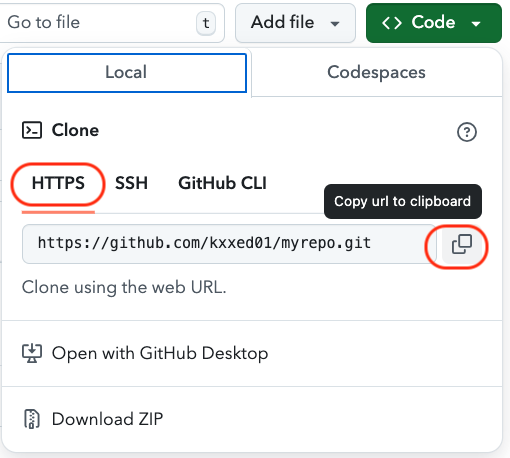

```{r setup, include=FALSE}
knitr::opts_chunk$set(echo = TRUE)
```

What follows is a step by step path for getting the  GitHub-RStudio Server connection up and running.^[Document adapted from https://happygitwithr.com]

## 1. Create GitHub account

This should be completed already. If not, refer to the [screencast](https://kzoo-my.sharepoint.com/:v:/g/personal/eric_nordmoe_kzoo_edu/EVEcr9wrpjFFizD-UkuoZyIBDvCNWCye_JJLJJKuGmLasw?e=tcxnNU) posted earlier. 

## 2. Create a New Repository with Only README.md

Click the green "New repository" button. Or, if you are on your own profile page, click on "Repositories", then click the green "New" button.  

How to fill this in:  

* Repository name: **myrepo** (or whatever you wish, we’ll delete this soon anyway).  

* Description: “Testing my setup” (or whatever, but some text is good for the README).  

* Public.   

* YES Initialize this repository with a README.  

For everything else, just accept the default.  

Click the big green button “Create repository.”  

## 3. Log into your account on rstudio.kzoo.edu  

Use your KNET user name and password as instructed at the login page.

## 4. Configure RStudio with your Name and email used for GitHub 

Before running this, be sure to replace the text shown with your username and the email you used for your GitHub account. 

```{r, eval=FALSE}
## install if needed (do this exactly once):
## install.packages("usethis")
library(usethis)
use_git_config(user.name = "Demo Student1", user.email = "kxxed01@protonmail.com")
```

## 5. Set credentials in RStudio  

### Create and store your personal access token (PAT)  

The personal access token (PAT) is used when interfacing with the GitHub repository. It identifies you to GitHub and, if stored (cached) properly, should not have to be entered each time you push an update to a repository.  

Use the following commands to create your PAT. You must **store this token somewhere**, because you'll never be able to see it again, once you leave this browser window. (If you somehow goof this up, just generate a new PAT and, so you don't confuse yourself, delete the lost token.)

The **usethis** package has a helper function `create_github_token()` that takes you to the web form to create a PAT, with the added benefit that it pre-selects the recommended "scopes." Accept the defaults. Use these commands at the R command line. When taken to GitHub, create your Personal Access Token and copy it (save it somewhere as mentioned above!). If you use a password management app, such as 1Password or LastPass, this is a great time to add your PAT to the entry for GitHub. 

```{r, eval=FALSE}
# the library usethis should have been loaded above
# Running the following will take you to GitHub to create your PAT
create_github_token()
```

At this point, we assume you’ve created a PAT and have it available on your clipboard.

### Put your PAT into the Git credential store  

There is another package **gitcreds** that will help to save the credentials so that the PAT in the credential store so you won't have to enter it every time you push to the GitHub repository. 

Enter the following at the command line:  

```{r, eval= FALSE}
gitcreds::gitcreds_set()
```

If you don’t have a PAT stored already, it will prompt you to enter your PAT. Paste it in! 

If you already have a stored credential, `gitcreds::gitcreds_set()` reveals this and will even let you inspect it. This helps you decide whether to keep the existing credential or replace it. When in doubt, embrace a new, known-to-be-good credential over an old one, of uncertain origins.  

### Check your credentials  

Use the following to check that everything worked:

```{r, eval = FALSE}
usethis::git_sitrep()
```


This function shows whether a GitHub PAT is discovered and provides information about the associated user, the PAT's scopes, etc. You may see some red marks but a key point is whether the token is "discovered" as shown in the figure below.  

```{r, out.width='50%', fig.align='center', fig.cap='',echo=FALSE}
knitr::include_graphics('figs/sitrep_out.png')
```


This step is something you do once. Or, rather, once per machine, per PAT. From this point on, usethis and its dependencies should be able to automatically retrieve and use this PAT.

Be sure to keep your RStudio session open during the steps that follow.

## 6. Clone the new repository to your RStudio Server account  

1. Go to the new **myrepo** repository on your github.com account.  

2. Copy the HTTPS clone URL to your clipboard via the green “Code” button.  

```{r, out.width='50%', fig.align='center', fig.cap='',echo=FALSE}

```


3. Go back to RStudio (rstudio.kzoo.edu). 

In RStudio, start a new Project as follows:  

* *File > New Project > Version Control > Git*. In "Repository URL", paste the URL of your new GitHub repository. It will be something like this `https://github.com/enordmoe/myrepo.git` .    

* Accept the default project directory name, e.g. **myrepo**, which coincides with the GitHub repo name (or type it in if necessary).   

* Take charge of--- or at least notice!---where the Project will be saved. A common  mistake is to have no idea where you are saving files or what your working directory is. The "tilde" character '~' represents "home" so I suggest you use `~/tmp` so that the project is in temporary folder since we're really not going to do anything much with it. This is not necessary but may help you find things more easily.  

* Check "Open in new session", as that's what you'll usually do in practice.  

* Click "Create Project" 

You should find yourself in a new local RStudio Project that represents the new test repo we just created on GitHub. This should download the `README.md` file from GitHub. Look in RStudio's file browser pane for the `README.md` file. 

## 7. Make local changes, save, commit  

From RStudio, modify the `README.md` file, e.g., by adding the line "This is a line from RStudio". Save your changes.  

Commit these changes to your local repo. How?  

From RStudio:  

* Click the "Git" tab in upper right pane.  

* Check the "Staged" box for `README.md`.  

* If you're not already in the Git pop-up, click "Commit". This gets the file (or files) ready to be "push"ed to GitHub repository.  

## 8. Push your local changes online to GitHub  

Click the green "Push" button to send your local changes to GitHub. If you are challenged for username and password, provide them but for your password, you would paste in the PAT created earlier. You should see some message along these lines.  

```
[master dc671f0] blah
 3 files changed, 22 insertions(+)
 create mode 100644 .gitignore
 create mode 100644 myrepo.Rproj
```

## 9.  Confirm the local change propagated to the GitHub remote  

Go back to the browser. I assume we're still viewing your new GitHub repo.

Reload the web page to refresh the display.  

You should see the new "This is a line from RStudio" in the README.

If you click on “commits”, you should see one with the message “Commit from RStudio”.

If you have made it this far, you are DONE with set up. But let me know if you were challenged for the GitHub username and password when you pushed to the repository. 

## 10. Clean up 

If you like, you can (but don't have to) remove the repository since we just created this for testing purposes.

**Local** When you're ready to clean up, you can delete the local repo any way you like. It's just a regular directory on the server.  

**GitHub In the browser**, go to your repo's landing page on GitHub. Click on “Settings”.  

Scroll down, click on "delete repository," and do as it asks. The dire warnings are there so you don't accidentally delete a huge project. 


