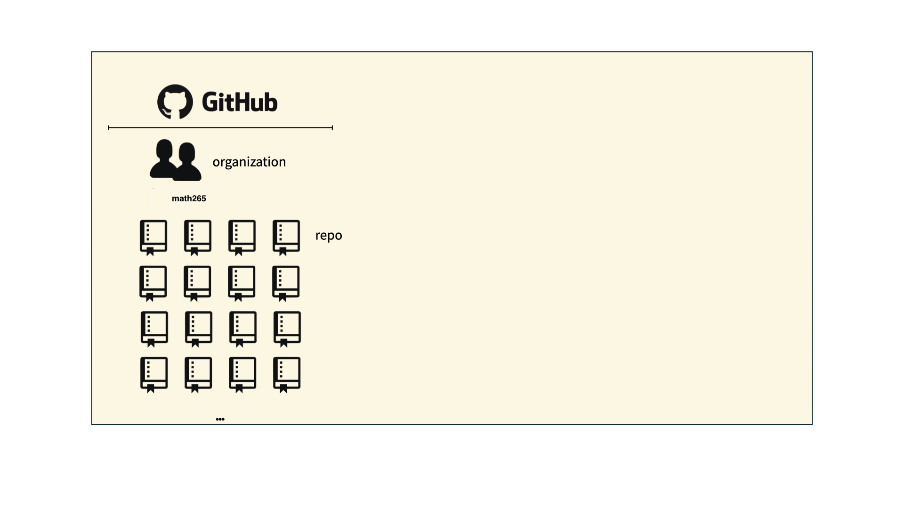
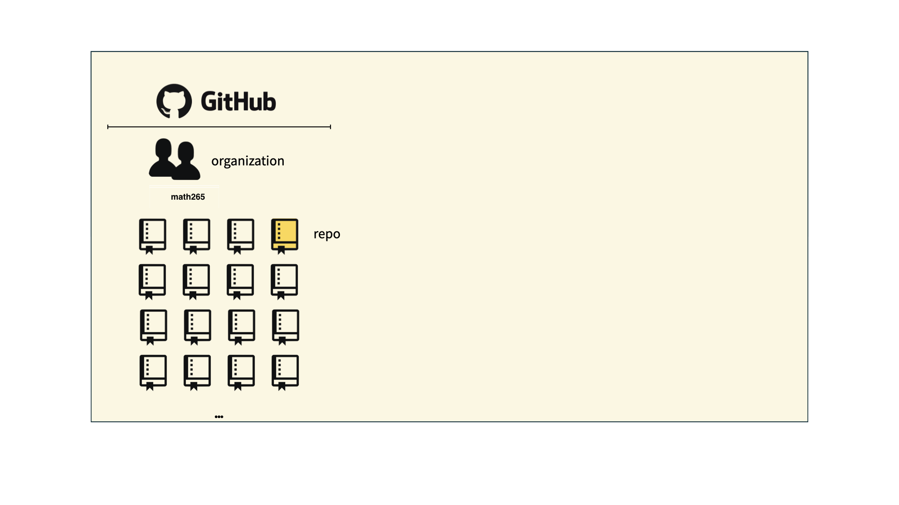
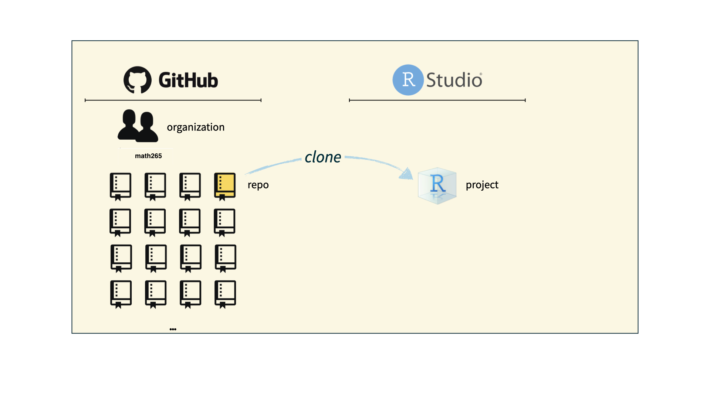
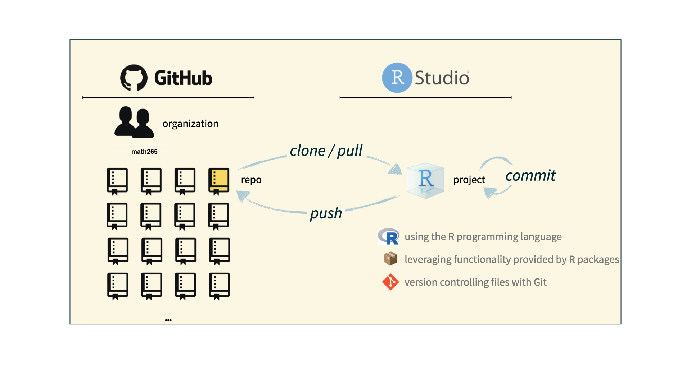
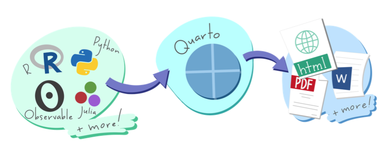
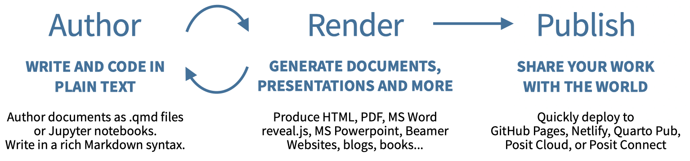

```{r setup, include=FALSE}
knitr::opts_chunk$set(echo = TRUE,message=FALSE,warning=FALSE)
```


```{r, echo=F,message=FALSE}
library(tidyverse)
```


# Outcomes for Today

* Get more familiar with the RStudio IDE

* Get RStudio to talk to GitHub

* Learn about Quarto documents

* Gain awareness of available references

* Use Quarto to create a simple document to be pushed to a GitHub repository

---
class: inverse, center, middle

# Version Control and Collaboration

---

# Git and GitHub

.pull-left[
```{r echo=FALSE, out.width="25%"}
knitr::include_graphics("img/git-logo.png")
```
- Git is a version control system -- like “Track Changes” features from Microsoft Word, on steroids

- It's not the only version control system, but it's a very popular one

- Was created by Linus Torvalds in 2005
]
.pull-right[
```{r echo=FALSE, out.width="25%"}
knitr::include_graphics("img/GitHub_Logo.png")
```
- GitHub is the home for your Git-based projects on the internet -- like Dropbox but much, much better

- We will use GitHub as a platform for submitting homework and collaboration on projects
]

---
## Git vs GitHub

* What's the difference?

<div style="text-align:center;">

</div>

* We will use RStudio running Git behind the scenes to interface with GitHub

.left[.footnote[Source: https://blog.devmountain.com/git-vs-github-whats-the-difference/]]


---

## Versioning

```{r echo=FALSE, fig.align = "center", out.width = "70%"}
knitr::include_graphics("img/lego-steps.png")
```

Source: [Data Science in a Box](https://datasciencebox.org/)
???

Note that in a real construction project, progress is not so linear. There may be work going on in several parts of the building.
---

## Versioning
### with human readable commit messages

```{r echo=FALSE, fig.align = "center", out.width = "60%"}
knitr::include_graphics("img/lego-steps-commit-messages.png")
```

???


---

## Why do we need version control?

```{r echo=FALSE, fig.align = "center", out.width="35%"}
knitr::include_graphics("img/phd_comics_vc.gif")
```

* Document project
* Facilitate team collaboration
* Share work


---

## How will we use Git and GitHub?

```{r echo=FALSE, out.width="100%"}

```

---

## How will we use Git and GitHub?

```{r echo=FALSE, out.width="100%"}

```

---

## How will we use Git and GitHub?

```{r echo=FALSE, out.width="100%"}

```

---

## How will we use Git and GitHub?

```{r echo=FALSE, out.width="100%"}

```

---

# Git and GitHub tips

- Becoming Git masters is beyond the scope of the course.

- Using the RStudio server to interface with GitHub will allow us to focus on just a few commands and avoid command line complications.

--
- For much more on working with git and R, consult  [happygitwithr.com](http://happygitwithr.com/). 

---
class: inverse, center, middle

# Getting Started with GitHub and RStudio Server activity

---

class: inverse, center, middle

# Let's talk about Quarto

---

# Quarto documents  

**Quarto** is an open source scientific and technical publishing system.

* Input (`qmd`) can contain code chunks, text content, LaTeX mathematical formatting.
  - Code chunks can be R, Python, Julia and Observable JavaScript
  - Visual editor built into RStudio
--

* Produces dynamic reports including text, code, tables, equations, citations, cross references, output, figures and advanced layouts.
  - Many document types: articles, presentations, dashboards, websites, books, etc.
  - Multiple output formats such as HTML, MS Word, and many more
  - Many style themes available to change the look and feel of the document
  
--

* Emphasis is on sharability, reproducibility, and versatility  


Source: [Quarto.org](https://quarto.org/)
---

# The Quarto Document Process  

```{r, out.width='100%', fig.align='center', fig.cap='',echo=FALSE}

```

Source:  [Quarto Cheat Sheet](https://rstudio.github.io/cheatsheets/html/quarto.html)

---

# The Quarto Document Process with Details  

```{r, out.width='100%', fig.align='center', fig.cap='',echo=FALSE}

```

Source:  [Quarto Cheat Sheet](https://rstudio.github.io/cheatsheets/html/quarto.html)

---

# Reproducibility  

Value of reproducibility: 

* Transparency of research

--

* Verification of code

--

* Longer term
    - use code/analysis for new or updated data
    - extend/modify analysis for other settings/data
    


